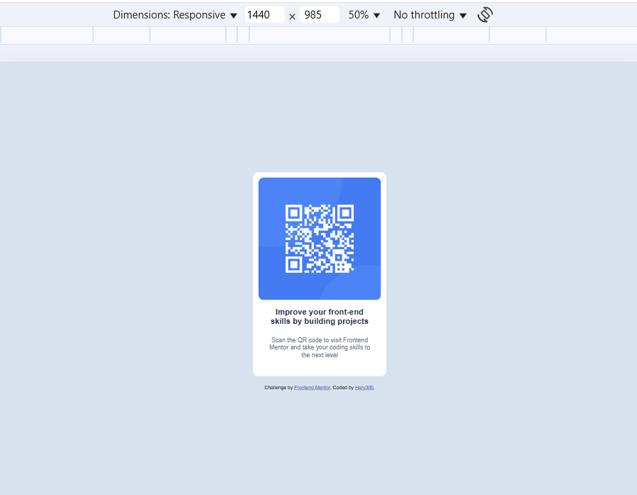

# Frontend Mentor - QR code component solution


This is a solution to the [QR code component challenge on Frontend Mentor](https://www.frontendmentor.io/challenges/qr-code-component-iux_sIO_H).

## Table of contents

- [Overview](#overview)
  - [Screenshot](#screenshot)
  - [Links](#links)
- [My process](#my-process)
  - [Built with](#built-with)
  - [What I learned](#what-i-learned)

## Overview

### Screenshot




### Links

- Solution URL: [Add solution URL here](https://github.com/Hary300/QR-code)
- Live Site URL: [Add live site URL here](https://hary300.github.io/QR-code/)

## My process

### Built with

- Semantic HTML5 markup
- CSS custom properties
- Flexbox

### What I learned

1. Centering with Flexbox

   1. Add a wrapper element (e.g., `<main class="container">…</main>`).
   2. Give the page a full-height context:
      ```css
      html,
      body {
        height: 100%;
      }
      body {
        margin: 0;
      }
      ```
   3. Center the wrapper with Flexbox:
      ```css
      .container {
        height: 100vh; /* full viewport height */
        display: flex; /* enable flex layout   */
        justify-content: center; /* horizontal center    */
        align-items: center; /* vertical center      */
      }
      ```
   4. Verify in DevTools (Inspect) that `.container` is the flex parent.

2. Using `100vh` correctly

   1. Apply `height: 100vh;` on the centering container (or `body`) so there’s vertical space to center within.
   2. Remember: `vh` = viewport height; `100vh` = full screen height.
   3. Tip (mobile): If needed on mobile browsers, prefer centering on a specific card with padding, or consider `min-height: 100svh;` for modern mobile viewport units.

3. Writing better Git commit messages

   1. Stage your changes:
      ```bash
      git add .
      ```
   2. Commit using imperative style + a clear type:
      ```bash
      git commit -m "feat: add QR code component layout"
      ```
      Common types: `feat`, `fix`, `style`, `docs`, `refactor`, `chore`.
   3. Push:
      ```bash
      git push origin main
      ```
   4. Example sequence for this project:
      - `chore: initialize project structure`
      - `feat: add QR code card markup`
      - `style: center card with flexbox and 100vh`
      - `docs: add screenshot and update README`

4. Adding an image to `README.md`

   1. Put your screenshot file next to `README.md`, e.g. `screenshot.jpg`.
   2. Reference it in Markdown with alt text:
      ```md
      
      ```
   3. Commit & push the image and README changes so GitHub can render it.

5. Publishing with GitHub Pages (Live Site URL)

   1. Ensure your site entry file is `index.html` at the repo root.
   2. On GitHub: **Repo → Settings → Pages**.
   3. Source: **Deploy from a branch** → Branch: **main** → Folder: **/** (root) → **Save**.
   4. Wait for the Pages build. Your Live URL will look like:
      ```
      https://USERNAME.github.io/REPO-NAME/
      ```
      Example: `https://Hary300.github.io/QR-code/`
   5. If you get 404, confirm `index.html` is in the selected folder (root or `/docs`) and recheck the Pages settings.

6. (Optional) Removing a file from the repo
   - Delete from GitHub and local:
     ```bash
     git rm filename.ext
     git commit -m "remove: delete filename.ext"
     git push origin main
     ```
   - Keep locally but remove from repo:
     ```bash
     git rm --cached filename.ext
     git commit -m "chore: stop tracking filename.ext"
     git push origin main
     ```
     Then add it to `.gitignore`.
